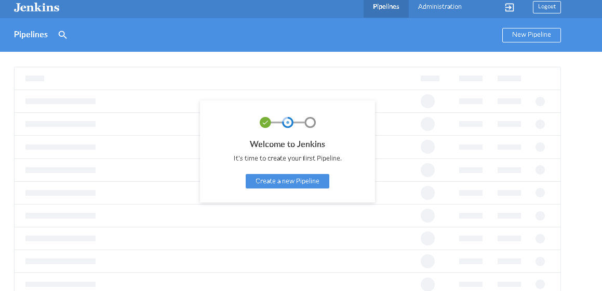
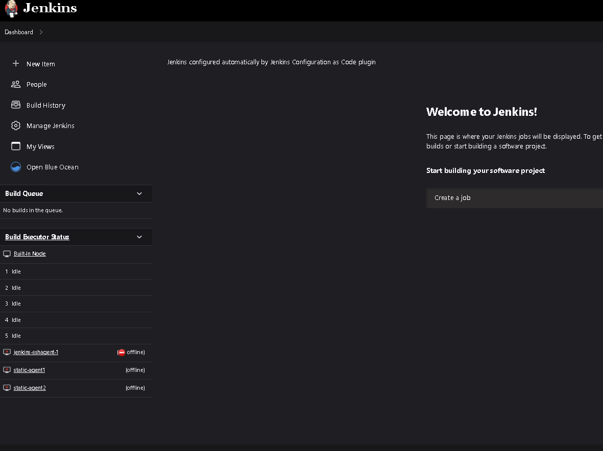
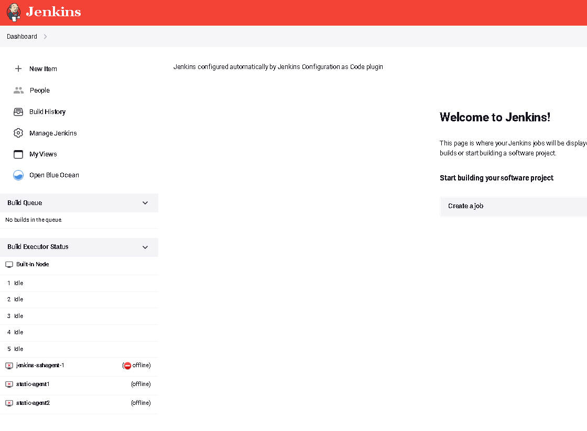

## Overview

# Why? 

Waiting to install plugins is a hassle, `configuration-as-code` Jenkins plugin only covers configuration for already installed plugins so to fully impletement Jenkins as code, we will use docker to generate our own local Jenkins images that can be completely customized to your use-case

Jenkins Configuration as code. This repository will contain complete configuration setups for deploying Jenkins with various preinstalled plugins, reducing the initial installprocess time. 

Plugins can be selectively specified, also including various different Jenkins UI themes you can set within the `Dockefile`.

## Directory Setup 

- Default Jenkins plugins will be found under `./default_plugins.txt`
- Custom Jenkins plugins will be found under `./custom_plugins.txt`
- Custom Jenkins Themes will be found under `./themes.txt`

By default, only Default & Custome Jenkins Plugins will be installed during the `docker build step` Please follow the steps under `Themes` for more information on how to preinstall & configure your theme settings using `configuration-as-code` plugin.  

## Custom Plugins List 

The following are a list of Plugins that we've built into this repository.

If you don't want any of these plugins installed, simply remove the `custom_plugins.txt` file
To skip a certain plugin, remove the plugin from `custom_plugins.txt`


SCM 

- [Bitbucket](https://plugins.jenkins.io/bitbucket/)  
- [GitLab](https://plugins.jenkins.io/gitlab-plugin/) 
- [Generic Webhook Trigger](https://plugins.jenkins.io/generic-webhook-trigger/)

Tools

- [Amazon EC2](https://plugins.jenkins.io/amazon-ec2/) 
- [Amazon ECR](https://plugins.jenkins.io/amazon-ecr/) 
- [Amazon ECS](https://plugins.jenkins.io/amazon-ecs/)
- [Configuration As Code](https://www.jenkins.io/projects/jcasc/) 
- [Docker](https://plugins.jenkins.io/docker-plugin/) 
- [Docker Pipeline](https://plugins.jenkins.io/docker-workflow/) 
- [Docker Build & Push](https://plugins.jenkins.io/docker-build-publish/) 
- [Kubernetes](https://plugins.jenkins.io/kubernetes/) 
- [NodeJs](https://plugins.jenkins.io/nodejs/) 

Themes

- [Blue Ocean](https://plugins.jenkins.io/blueocean/)
- [Dark Theme](https://plugins.jenkins.io/dark-theme/)
- [Material Theme](https://plugins.jenkins.io/material-theme/)
- [Simple Theme](https://plugins.jenkins.io/simple-theme-plugin/)


## Import your own existing Jenkins Plugin List

Use the `generate-plugins` bash script to import your own Jenkins Plugin list.

```
tony@test-lab jenkins-as-code % ./generate-plugins 

curl https://jenkins-hostname/jnlpJars/jenkins-cli.jar
  % Total    % Received % Xferd  Average Speed   Time    Time     Time  Current
                                 Dload  Upload   Total   Spent    Left  Speed
100 3337k  100 3337k    0     0  2933k      0  0:00:01  0:00:01 --:--:-- 2943k

java -jar jenkins-cli.jar -s https://jenkins-hostname -auth admin_user:admin_password groovy = plugins.txt
```

You will see a newly generated file called `plugins.txt`

# Quick Start

To see a working demo, simply git clone this repo then run `docker-compose up -d` which will create a new jenkins-docker-container on local.


## Dockerfile Instructions

You can create your own custom Jenkins image based off off `jenkins/jenkins` docker image that is pre-configured with plugins. Which you can then use the `configuration-as-code` Jenkins Plugin to finalize the rest of your setup. 

## Themes


# Blue Ocean



# Dark-theme



# Material-theme




## Jenkins Configuration As Code (JCasc)

The following code snippets below are for your reference when building out your own `jcasc.yaml` file. During the docker build step, the docker image will be built with `CASC_CONFIGS` mounted to `/var/jenkins_home/casc_configs` which is where `configuration-as-code` will check for configuration `YAML` files.


Jenkins

A simple Jenkins `YAML` file that serves as the base of all of our `YAML` files. Applying this configuration will create a standard Jenkins Master Node with 5 concurrent builds. 

```
jenkins:
  systemMessage: "Jenkins configured automatically by Jenkins Configuration as Code plugin\n\n"
  numExecutors: 5
  scmCheckoutRetryCount: 2
  mode: NORMAL
```

Agents

A simple Jenkins Agent `YAML` configuration block that you can add within your `jcasc.yaml` files to configure your `jenkins-agents`. The following details below will include an example confiuguration block.

SSH-Agent
```
 nodes:
    - permanent:
        name: "jenkins-sshagent-1"
        remoteFS: "/home/jenkins-sshagent1"
        retentionStrategy: "always"
        launcher:
          ssh:
            credentialsId: $SSH_CREDENTIALS
            host: "localhost:8080"
            port: 22
            sshHostKeyVerificationStrategy: "knownHostsFileKeyVerificationStrategy"
```

- `name:` The Name of your Jenkins Agent
- `remoteFS:` Location of remote directory for Jenkins Java Agent 
- `retentenionStrategy:` How often to keep this Agent Running For
- `launcher:` Our connection launcher method for the agent
- `ssh:` Our connection method
- `host:` Our Jenkins Agent server address
- `port:` Our Jenkins Agent Port
- `sshHostKeyVerificationStrategy:` SSH auth method


Inbound-Agent

```
    - permanent:
        name: "static-agent1"
        remoteFS: "/home/jenkins-agent1"
        launcher:
          inbound:
            workDirSettings:
              disabled: true
              failIfWorkDirIsMissing: false
              internalDir: "remoting"
              workDirPath: "/tmp"
```

Themes

A simple `jcasc` `YAML` block for themes 


Dark Theme

```
unclassified:
  themeManager:
    disableUserThemes: true
    theme: "dark" 
```

Material Theme

```
unclassified:
  themeManager:
    disableUserThemes: true
    theme: "material-indigo" # or 'material-red' or 'material-grey' or 'material-light-blue'
```
